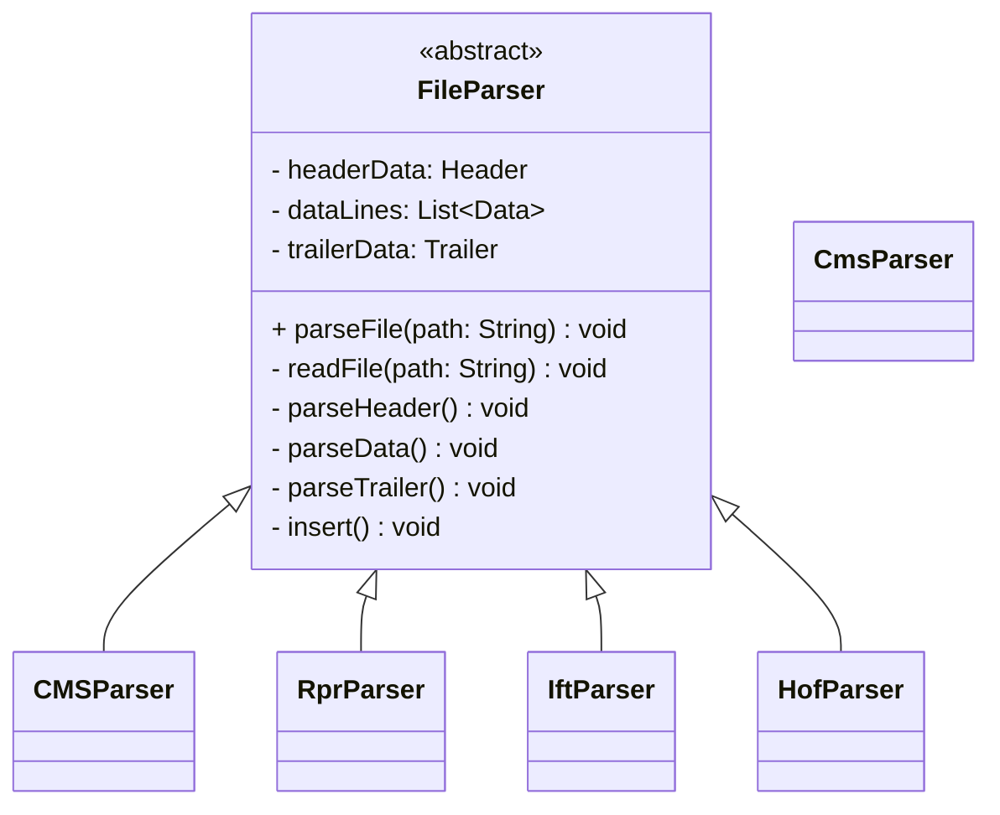

## 템플릿 메서드 패턴 UML

```mermaid
classDiagram
    class FileParser {
        <<abstract>>
        - headerData: Header
        - dataLines: List~Data~
        - trailerData: Trailer
        + parseFile(path: String) void
        - readFile(path: String) void
        - parseHeader() void
        - parseData() void
        - parseTrailer() void
        - insert() void
    }

    class CmsParser
    class RprParser
    class IftParser
    class HofParser

    FileParser <|-- CMSParser
    FileParser <|-- RprParser
    FileParser <|-- IftParser
    FileParser <|-- HofParser

```
