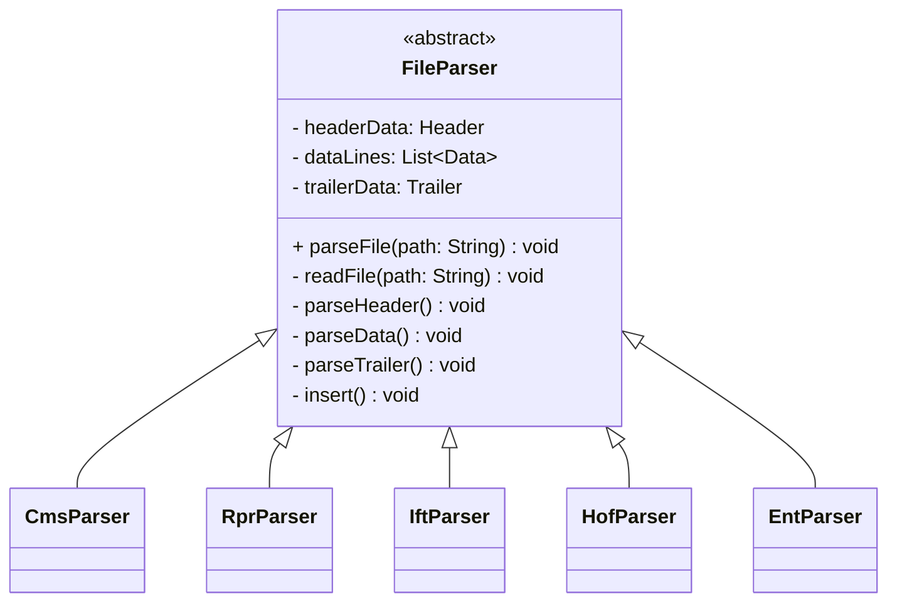

## 템플릿 메서드 패턴 UML

```mermaid
classDiagram
    class FileParser {
        <<abstract>>
        - headerData: Header
        - dataLines: List~Data~
        - trailerData: Trailer
        + parseFile(path: String) void
        - readFile(path: String) void
        - parseHeader() void
        - parseData() void
        - parseTrailer() void
        - insert() void
    }

    class CmsParser
    class RprParser
    class IftParser
    class HofParser
    class EntParser

    FileParser <|-- CmsParser
    FileParser <|-- RprParser
    FileParser <|-- IftParser
    FileParser <|-- HofParser
    FileParser <|-- EntParser

```

## 팩토리 메서드 패턴 UML

```mermaid
classDiagram
    direction LR

    %% Enum
    class NotificationType {
        <<enum>>
        EMAIL
        SMS
        PUSH
    }

    %% Interface
    class Notification {
        +send(templateId: String, params: Map<String, Object>): void
    }

    %% Concrete Implementations
    class SmsNotification {
        +send(templateId: String, params: Map<String, Object>): void
    }

    class EmailNotification {
        +send(templateId: String, params: Map<String, Object>): void
    }

    class PushNotification {
        +send(templateId: String, params: Map<String, Object>): void
    }

    %% Annotation
    class NotificationPolicy {
        <<annotation>>
        +value(): NotificationType
    }

    %% Factory
    class NotificationFactory {
        -strategies: Map<NotificationType, Notification>
        +getByType(type: NotificationType): Notification
    }

    %% Service to build message
    class MessageTemplateService {
        +buildMessage(templateId: String, params: Map<String, Object>): String
    }

    %% Repository for template
    class NotificationRepository {
        +findById(id: String): Optional<String>
    }

    %% Client
    class NotificationService {
        +send(type: NotificationType, templateId: String, params: Map<String, Object>): void
    }

    %% Relationships
    Notification <|.. SmsNotification
    Notification <|.. EmailNotification
    Notification <|.. PushNotification

    SmsNotification --> MessageTemplateService
    EmailNotification --> MessageTemplateService
    PushNotification --> MessageTemplateService

    NotificationFactory --> Notification
    NotificationFactory --> NotificationType

    MessageTemplateService --> NotificationRepository

    NotificationService --> NotificationFactory

    SmsNotification --> NotificationPolicy
    EmailNotification --> NotificationPolicy
    PushNotification --> NotificationPolicy
```
