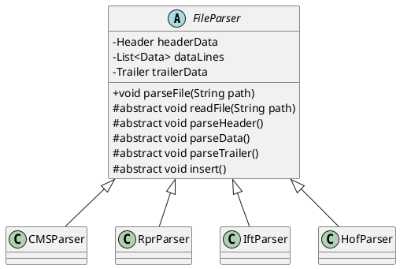

## 템플릿 메서드 패턴 UML

```plantuml
@startuml
skinparam classAttributeIconSize 0

abstract class FileParser {
    - Header headerData
    - List<Data> dataLines
    - Trailer trailerData

    + void parseFile(String path)
    # abstract void readFile(String path)
    # abstract void parseHeader()
    # abstract void parseData()
    # abstract void parseTrailer()
    # abstract void insert()
}

class CMSParser {
}

class RprParser {
}

class IftParser {
}

FileParser <|-- CMSParser
FileParser <|-- RprParser
FileParser <|-- IftParser
FileParser <|-- HofParser
@enduml

```
