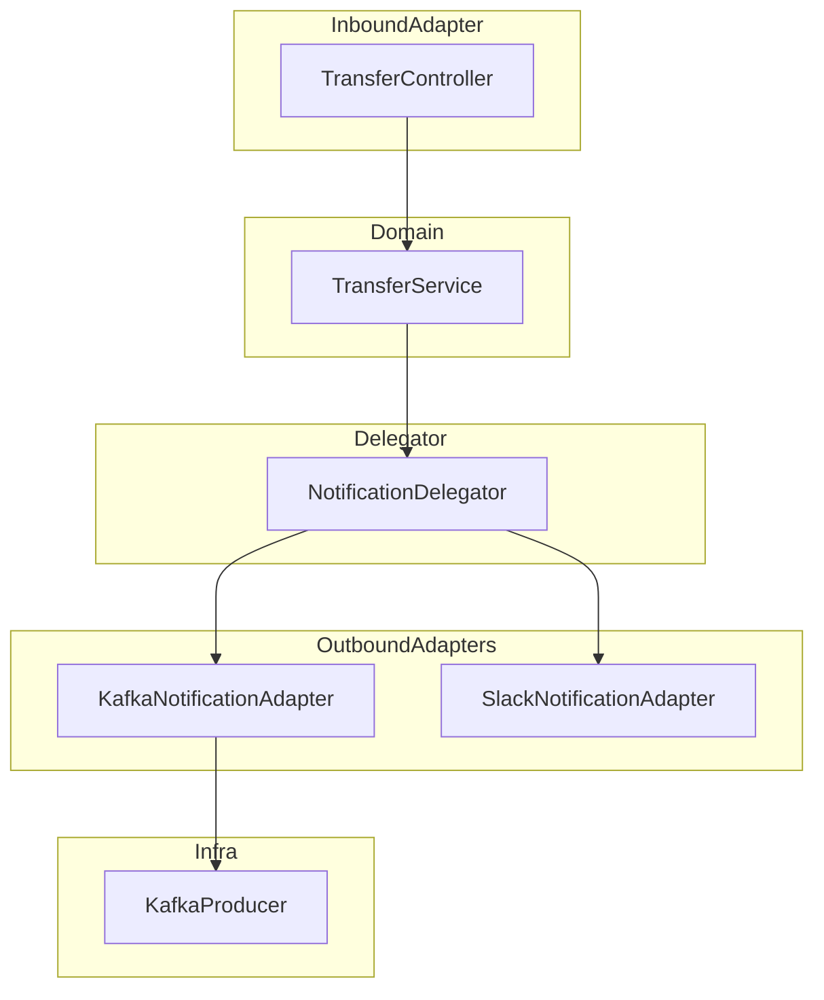

## 어댑터 패턴 구현 예제

송금 완료 시 알림 메시지를 발행하는 구조를 Port & Adapter 패턴으로 구현  
예시로, Kafka(운영 환경), Slack(개발/테스트 환경) 등 다양한 알림 채널을 어댑터로 분리하고,  
실행 환경에 따라 유연하게 선택 발송되도록 설계

```mermaid
flowchart TD
    subgraph Infra
        KafkaProducer
    end

    subgraph OutboundAdapters
        KafkaNotificationAdapter --> KafkaProducer
        SlackNotificationAdapter
    end

    subgraph Delegator
        NotificationDelegator --> KafkaNotificationAdapter
        NotificationDelegator --> SlackNotificationAdapter
    end

    subgraph Domain
        TransferService --> NotificationDelegator
    end

    subgraph InboundAdapter
        TransferController --> TransferService
    end
```
