## 팩토리 메서드 패턴 UML

전송 채널을 몰라도 메시지를 발송할 수 있는, 전략 패턴 + 템플릿 시스템 기반의 알림 서비스 예제  
수신 채널(예: 이메일, SMS 등)을 모르는 상태에서도 템플릿 ID와 파라미터만 전달하면 알림을 발송할 수 있도록 설계된 구조  
알림 채널은 @NotificationPolicy 애너테이션을 통해 자동 등록되며, NotificationFactory는 타입에 따라 적절한 구현체를 주입  

```mermaid
classDiagram
    direction LR

    %% Enum
    class NotificationType {
        <<enum>>
        EMAIL
        SMS
        PUSH
    }

    %% Interface
    class Notification {
        +send(templateId: String, params: Map<String, Object>): void
    }

    %% Concrete Implementations
    class SmsNotification {
        +send(templateId: String, params: Map<String, Object>): void
    }

    class EmailNotification {
        +send(templateId: String, params: Map<String, Object>): void
    }

    class PushNotification {
        +send(templateId: String, params: Map<String, Object>): void
    }

    %% Annotation
    class NotificationPolicy {
        <<annotation>>
        +value(): NotificationType
    }

    %% Factory
    class NotificationFactory {
        -strategies: Map<NotificationType, Notification>
        +getByType(type: NotificationType): Notification
    }

    %% Service to build message
    class MessageTemplateService {
        +buildMessage(templateId: String, params: Map<String, Object>): String
    }

    %% Repository for template
    class NotificationRepository {
        +findById(id: String): Optional<String>
    }

    %% Client
    class NotificationService {
        +send(type: NotificationType, templateId: String, params: Map<String, Object>): void
    }

    %% Relationships
    Notification <|.. SmsNotification
    Notification <|.. EmailNotification
    Notification <|.. PushNotification

    SmsNotification --> MessageTemplateService
    EmailNotification --> MessageTemplateService
    PushNotification --> MessageTemplateService

    NotificationFactory --> Notification
    NotificationFactory --> NotificationType

    MessageTemplateService --> NotificationRepository

    NotificationService --> NotificationFactory

    SmsNotification --> NotificationPolicy
    EmailNotification --> NotificationPolicy
    PushNotification --> NotificationPolicy
```

